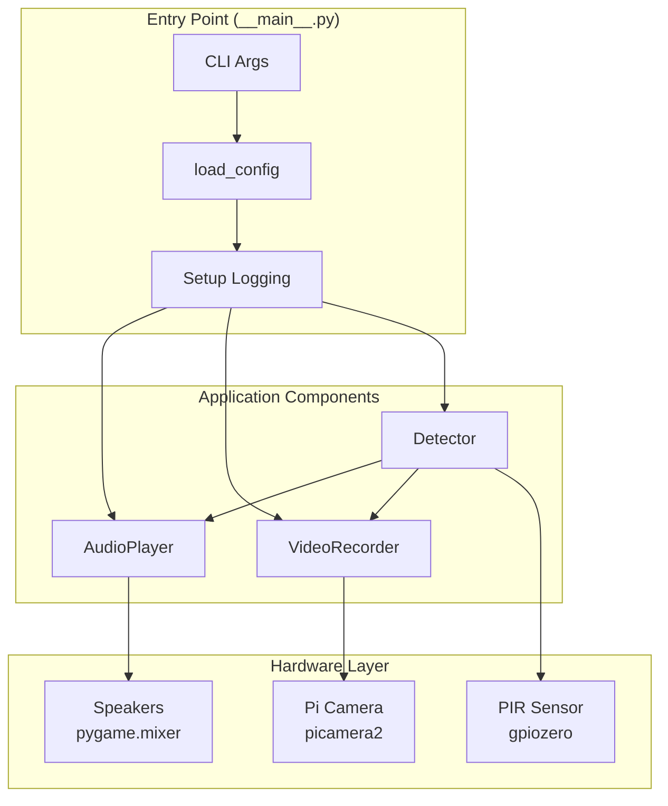
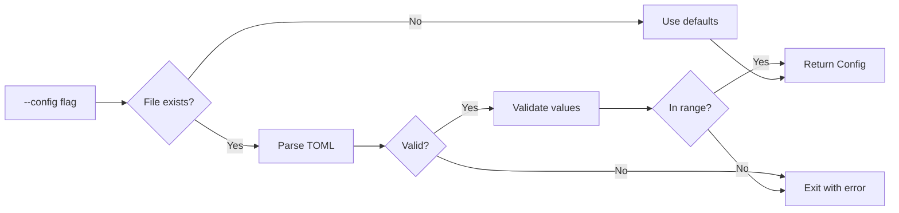

# Architecture

## Design Pattern

Single-process application with an event-driven blocking loop. Hardware I/O is abstracted behind classes with dependency injection for testability.

## System Architecture

## Concurrency Model

No explicit threading or multiprocessing. Both `pygame.mixer.music.play()` and `picamera2.start_recording()` are non-blocking — they manage background execution internally. The main thread blocks only on `MotionSensor.wait_for_motion()` and `wait_for_no_motion()`.

## Degradation Strategy

| Missing Resource | Behavior |
|-----------------|----------|
| Camera (picamera2) | WARNING logged, runs in audio-only mode |
| MP3 files | CRITICAL logged, `sys.exit(1)` |
| PIR sensor (gpiozero) | RuntimeError on init, application exits |
| Audio device (pygame) | Error on mixer.init(), application exits |

## Configuration Flow

## Key Design Decisions

- **Dataclass for config**: Type-safe, immutable-ish, with field defaults
- **Package-relative paths**: MP3 dir resolved from `__file__`, not CWD
- **Lazy camera import**: `picamera2` imported inside `VideoRecorder.__init__` to allow graceful degradation
- **No global state**: All components receive dependencies via constructors
