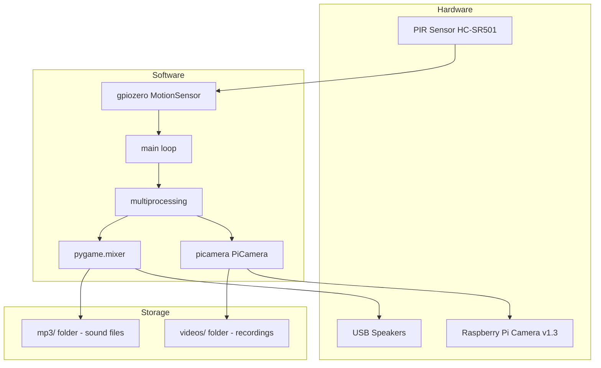

# Architecture

## Overview

The Halloween Motion Detector is a single-process, event-driven application designed to run continuously on a Raspberry Pi. It monitors a PIR sensor and reacts to motion by concurrently playing audio and recording video.

## System Architecture

## Design Patterns

### Event-Driven Loop
The application uses a blocking event loop pattern:
1. Wait for motion (`pir.wait_for_motion()`) — blocks until PIR triggers
2. React (start recording + play sound)
3. Wait for motion to stop (`pir.wait_for_no_motion()`) — blocks until PIR clears
4. Cleanup and sleep
5. Repeat

### Concurrent Execution
Camera recording and audio playback are launched as separate processes via `multiprocessing.Process` to avoid blocking each other.

### Random Selection
Each detection cycle randomly selects an MP3 from the bundled collection, providing variety in the scare experience.

## Layers

| Layer | Responsibility | Implementation |
|-------|---------------|----------------|
| Sensor | Detect motion via GPIO | gpiozero.MotionSensor (BCM pin 4) |
| Audio | Play random spooky sound | pygame.mixer |
| Video | Record while motion active | picamera.PiCamera |
| Orchestration | Coordinate detection/response cycle | main() event loop |
| Storage | Persist video recordings | File system (videos/ directory) |

## Deployment Model

- Runs directly on Raspberry Pi hardware
- Requires physical PIR sensor on GPIO pin 4 (BCM numbering)
- Requires Raspberry Pi Camera module connected via ribbon cable
- Requires USB speakers for audio output
- Intended to run as a foreground process (Ctrl+C to stop)
