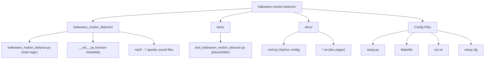

# Codebase Information

## Project Overview

- **Name**: halloween_motion_detector
- **Version**: 0.1.0
- **Author**: Andy Browne (andy.maildrop@gmail.com)
- **License**: GNU General Public License v3
- **Status**: Pre-Alpha (Development Status :: 2)
- **Repository**: https://github.com/frankenwino/halloween_motion_detector
- **Description**: Detects motion using PIR sensor. Plays a random spooky MP3 and records video when motion is detected.
- **Platform**: Raspberry Pi (requires GPIO, PiCamera hardware)

## Technology Stack

| Layer | Technology |
|-------|-----------|
| Language | Python 2.6–3.5 (shebang uses Python 3) |
| Hardware Interface | gpiozero (PIR/GPIO), picamera (camera) |
| Audio | pygame.mixer |
| Concurrency | multiprocessing |
| Build/Package | setuptools, Makefile |
| Testing | pytest, tox |
| Linting | flake8 |
| Documentation | Sphinx |
| Template | cookiecutter-pypackage (audreyr) |

## Directory Structure

## Key Files

| File | Purpose |
|------|---------|
| `halloween_motion_detector/halloween_motion_detector.py` | Main application logic — motion detection loop |
| `halloween_motion_detector/__init__.py` | Package metadata (author, version) |
| `halloween_motion_detector/mp3/` | 7 bundled spooky MP3 sound effects |
| `setup.py` | Package installation and dependency declaration |
| `Makefile` | Development workflow automation (clean, lint, test, docs, release) |
| `tox.ini` | Multi-environment test configuration |
| `setup.cfg` | bumpversion, wheel, and flake8 configuration |
| `requirements_dev.txt` | Development dependencies |

## Programming Languages

| Language | Supported | Notes |
|----------|-----------|-------|
| Python | ✅ | Primary and only language |

## Architectural Patterns

- **Single-module application**: All logic in one file (~96 lines)
- **Event-driven loop**: Infinite `while True` loop waiting for PIR sensor events
- **Multiprocessing for concurrency**: Camera recording and audio playback run in parallel processes
- **Random selection**: MP3 files chosen randomly from bundled collection
- **Graceful shutdown**: KeyboardInterrupt handler closes camera resource

## MP3 Sound Files

7 bundled Halloween-themed audio files:
- ShittyChickenGangBang.mp3
- Thunder.mp3
- PigSqueal.mp3
- TheHandsOfSmallChildren.mp3
- GreasePaintMonkeyBrains.mp3
- ZombieMoans.mp3
- Scream.mp3
