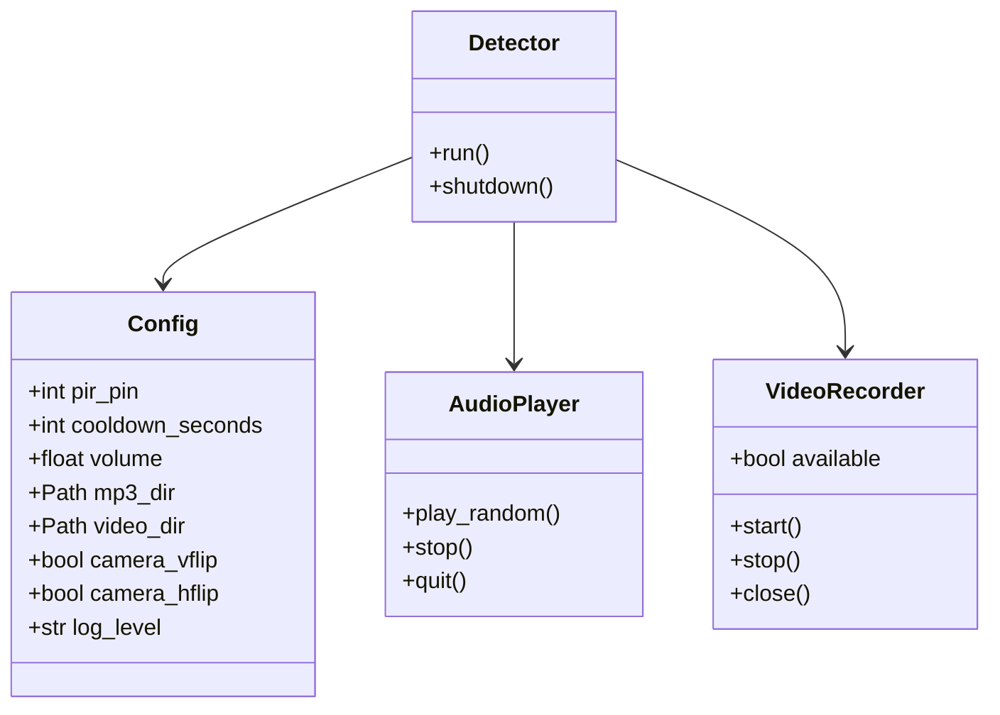

# Components

## Config (`config.py`)

**Responsibility**: Load, validate, and provide typed configuration.

- `Config` dataclass with 8 fields and sensible defaults
- `load_config(path)`: TOML parsing with fallback to defaults
- `_validate(config)`: Range checks for volume (0.0–1.0) and pin (0–27)
- Fatal exit on invalid TOML or out-of-range values

## AudioPlayer (`audio.py`)

**Responsibility**: Discover MP3 files and play them randomly.

- Discovers `.mp3` files via `Path.glob()` at init time
- Fatal exit if no MP3 files found (core functionality)
- `play_random()`: Non-blocking playback via `pygame.mixer.music`
- `stop()` / `quit()`: Cleanup methods

## VideoRecorder (`video.py`)

**Responsibility**: Record video with graceful degradation.

- Lazy-imports `picamera2` in `__init__` — catches `ImportError`/`RuntimeError`
- `available` property: `True` only if camera initialized successfully
- `start()`: Creates output dir, generates timestamped filename, starts recording
- `stop()`: Safe to call when not recording (no-op)
- `close()`: Stops recording if active, releases camera

## Detector (`detector.py`)

**Responsibility**: Orchestrate the motion → respond → cooldown cycle.

- Receives `Config`, `AudioPlayer`, `VideoRecorder` via constructor
- `run()`: Infinite blocking loop with `KeyboardInterrupt` handling
- `_on_motion()`: Triggers audio + video (skips video if unavailable)
- `_on_no_motion()`: Stops video, sleeps for cooldown
- `shutdown()`: Cleans up all resources

## Entry Point (`__main__.py`)

**Responsibility**: Wire everything together.

- Parse `--config` CLI argument
- Load config, setup logging
- Instantiate `AudioPlayer`, `VideoRecorder`, `Detector`
- Call `detector.run()`

## Component Relationships

