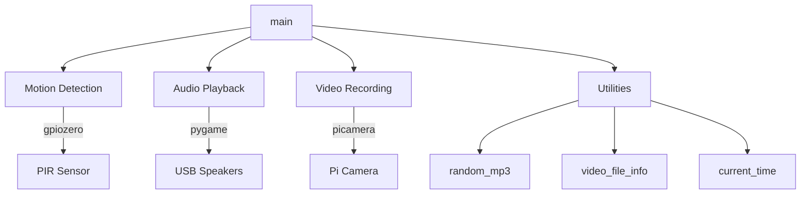

# Components

## Component Map

## Components

### main()
**File**: `halloween_motion_detector/halloween_motion_detector.py`
**Responsibility**: Orchestrates the entire detection-response cycle.

- Initializes hardware (PIR sensor, camera, audio mixer)
- Configures camera (vertical/horizontal flip) and volume
- Runs infinite event loop: wait → detect → respond → sleep
- Handles graceful shutdown on KeyboardInterrupt

### random_mp3()
**File**: `halloween_motion_detector/halloween_motion_detector.py`
**Responsibility**: Selects a random MP3 file from the `mp3/` folder.

- Lists all files in the mp3 directory
- Returns full path to a randomly chosen file
- Uses `randint` for selection

### video_file_info()
**File**: `halloween_motion_detector/halloween_motion_detector.py`
**Responsibility**: Generates video output path with timestamp-based filename.

- Creates `videos/` directory if it doesn't exist
- Returns dict with `path` and `name` keys
- Filename format: `YYYY-MM-DD_HH.MM.SS.h264`

### current_time()
**File**: `halloween_motion_detector/halloween_motion_detector.py`
**Responsibility**: Returns formatted timestamp string for logging.

- Format: `YYYY-MM-DD HH:MM:SS`

## Hardware Components

| Component | Model | Connection | Purpose |
|-----------|-------|-----------|---------|
| PIR Sensor | HC-SR501 | GPIO BCM pin 4 | Motion detection |
| Camera | Raspberry Pi Camera v1.3 (5MP, 1080p) | CSI ribbon cable | Video recording |
| Speakers | USB powered | USB port | Audio playback |

## Configuration (Hardcoded)

| Parameter | Value | Location |
|-----------|-------|----------|
| GPIO Pin | 4 (BCM) | `main()` |
| Camera vflip | True | `main()` |
| Camera hflip | True | `main()` |
| Volume | 10 | `main()` |
| Sleep time | 15 seconds | `main()` |
| Video format | h264 | `video_file_info()` |
