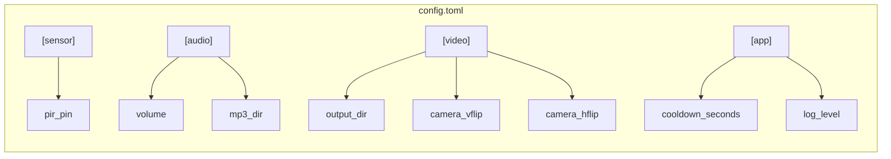

# Data Models

## Config Dataclass

```python
@dataclass
class Config:
    pir_pin: int = 4
    cooldown_seconds: int = 15
    volume: float = 0.7
    mp3_dir: Path = Path(__file__).parent / "mp3"
    video_dir: Path = Path.home() / "halloween-videos"
    camera_vflip: bool = True
    camera_hflip: bool = True
    log_level: str = "INFO"
```

## File Outputs

### Video Files

- **Location**: `{config.video_dir}/` (default: `~/halloween-videos/`)
- **Format**: H.264 raw video
- **Naming**: `YYYY-MM-DD_HH.MM.SS.h264`
- **Created**: Automatically on first recording; directory created if missing

### Audio Files (Input)

- **Location**: `{config.mp3_dir}/` (default: package `mp3/` directory)
- **Format**: MP3
- **Discovery**: `Path.glob("*.mp3")`, sorted alphabetically
- **Selection**: `random.choice()` per detection event

## TOML Configuration Schema



All fields are optional — missing sections or keys use `Config` defaults.

## State

The application maintains minimal runtime state:

| Component | State | Description |
|-----------|-------|-------------|
| AudioPlayer | `_mp3_files: list[Path]` | Discovered at init, immutable |
| VideoRecorder | `_recording: bool` | Whether currently recording |
| VideoRecorder | `_camera` | `Picamera2` instance or `None` |
| Detector | `_sensor` | `MotionSensor` instance |

No persistent state between runs. No database. No file-based state.
