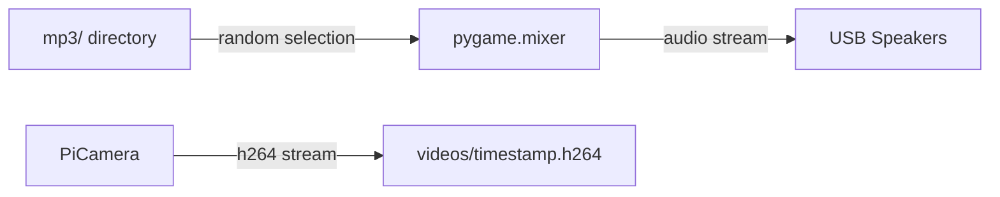

# Data Models

## Overview

This project uses simple built-in Python data types. There are no classes, ORM models, or complex data structures.

## Data Structures

### Video File Info Dictionary

Returned by `video_file_info()`:

```python
{
    "path": str,  # Full filesystem path, e.g. "/home/pi/videos/2026-10-31_20.30.15.h264"
    "name": str   # Filename only, e.g. "2026-10-31_20.30.15.h264"
}
```

## File Formats

### Input: MP3 Audio Files
- **Location**: `halloween_motion_detector/mp3/`
- **Format**: MPEG Audio Layer 3
- **Naming**: Descriptive names (no strict convention)
- **Usage**: Loaded by pygame.mixer for playback

### Output: Video Recordings
- **Location**: `./videos/` (relative to CWD at runtime)
- **Format**: H.264 raw video stream
- **Naming convention**: `YYYY-MM-DD_HH.MM.SS.h264`
- **Duration**: Variable — records for as long as motion is detected

## Data Flow



## Console Output Format

The application prints timestamped status messages to stdout:

```
2026-10-31 20:30:00 - Waiting for motion.
2026-10-31 20:30:05 - Motion detected. Recording video - 2026-10-31_20.30.05.h264
2026-10-31 20:30:12 - Motion stopped. Finished recording video - 2026-10-31_20.30.05.h264
2026-10-31 20:30:12 - Sleeping for 15 seconds
```
