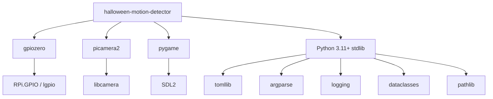

# Dependencies

## Runtime Dependencies

| Package | Purpose | Used By |
|---------|---------|---------|
| `gpiozero` | PIR motion sensor interface | `detector.py` (MotionSensor) |
| `picamera2` | Video recording (H.264) | `video.py` (Picamera2, H264Encoder) |
| `pygame` | Audio playback (MP3) | `audio.py` (mixer) |

## Standard Library Usage

| Module | Purpose | Used By |
|--------|---------|---------|
| `tomllib` | TOML config parsing | `config.py` |
| `argparse` | CLI argument parsing | `__main__.py` |
| `logging` | Structured logging | All modules |
| `dataclasses` | Config data structure | `config.py` |
| `pathlib` | File path handling | All modules |
| `random` | MP3 selection | `audio.py` |
| `time` | Cooldown sleep | `detector.py` |
| `datetime` | Video filename timestamps | `video.py` |
| `sys` | Fatal exit | `config.py`, `audio.py` |

## Development Dependencies

| Package | Purpose |
|---------|---------|
| `pytest` | Test framework |
| `pytest-cov` | Coverage reporting |
| `pytest-mock` | Mock utilities |

## Build System

| Tool | Role |
|------|------|
| `hatchling` | Build backend (PEP 517) |
| `pip` | Package installer |

## Platform Dependencies

| Requirement | Notes |
|-------------|-------|
| Raspberry Pi OS Bookworm+ | Required for picamera2 |
| SDL2 libraries | Required by pygame (`libsdl2-dev`) |
| Camera stack enabled | `raspi-config` → Interface Options |
| User in `gpio`, `video`, `audio` groups | Permission requirements |

## Dependency Graph

