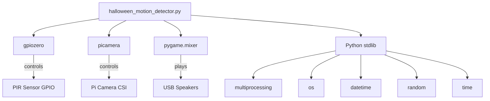

# Dependencies

## Runtime Dependencies

Declared in `setup.py`:

| Package | Purpose | Documentation |
|---------|---------|---------------|
| gpiozero | GPIO interface for PIR motion sensor | https://gpiozero.readthedocs.io |
| picamera | Raspberry Pi camera interface | https://picamera.readthedocs.io |

**Implicit runtime dependency** (not declared in setup.py):

| Package | Purpose | Documentation |
|---------|---------|---------------|
| pygame | Audio playback via `pygame.mixer` | http://www.pygame.org/docs/ref/music.html |

## Development Dependencies

From `requirements_dev.txt`:

| Package | Version | Purpose |
|---------|---------|---------|
| pip | >=21.1 | Package installer |
| bumpversion | 0.5.3 | Version bumping |
| wheel | >=0.38.1 | Wheel building |
| watchdog | 0.8.3 | File watching (servedocs) |
| flake8 | 2.6.0 | Linting |
| tox | 2.3.1 | Multi-env testing |
| coverage | 4.1 | Code coverage |
| Sphinx | 1.4.4 | Documentation generation |
| pytest | 2.9.2 | Test framework |

## Standard Library Usage

| Module | Purpose |
|--------|---------|
| multiprocessing | Concurrent camera/audio processes |
| os | File path operations, directory creation |
| time | Sleep between detection cycles |
| datetime | Timestamp generation |
| random | Random MP3 selection |

## Dependency Graph

## Notes

- **pygame is missing from `setup.py` `install_requires`** — this is a bug; the package will fail to install cleanly without it
- **picamera** is deprecated and replaced by `picamera2` for newer Raspberry Pi OS versions
- **gpiozero** is actively maintained and the recommended GPIO library
- All dev dependency versions are quite old (circa 2016), consistent with the cookiecutter template era
