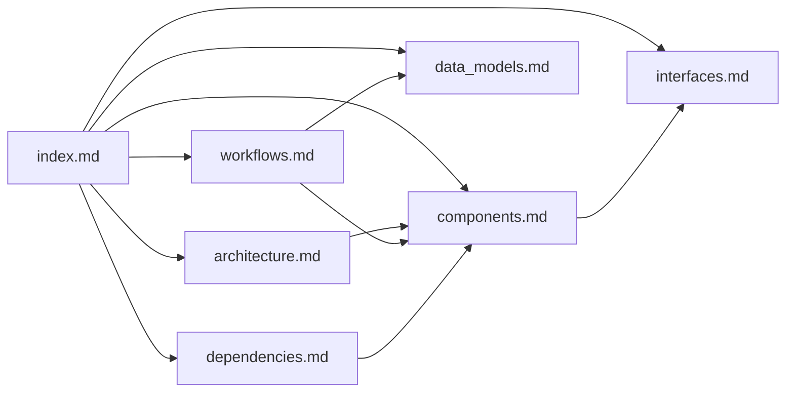

# Documentation Index — Halloween Motion Detector

## How to Use This Documentation (AI Assistants)

This index serves as your primary entry point for understanding the halloween-motion-detector codebase. Start here to determine which file contains the information you need.

**Quick navigation:**
- Architecture questions → `architecture.md`
- What does component X do? → `components.md`
- How do modules interact? → `interfaces.md`
- Data structures and formats → `data_models.md`
- How does the detection loop work? → `workflows.md`
- What libraries are used? → `dependencies.md`
- Raw codebase facts → `codebase_info.md`

## Project Summary

A Raspberry Pi application that uses a PIR motion sensor to trigger simultaneous MP3 playback (random spooky sound) and video recording. Single-module Python app (~96 LOC) with an event-driven infinite loop. Built from the cookiecutter-pypackage template.

## Documentation Files

| File | Purpose | Consult When... |
|------|---------|-----------------|
| [codebase_info.md](codebase_info.md) | Raw project facts: tech stack, file listing, directory structure | You need factual metadata about the project |
| [architecture.md](architecture.md) | System design, hardware/software layers, event-driven pattern | You need to understand the overall design or add new features |
| [components.md](components.md) | Individual components and their responsibilities | You need to modify or understand a specific part |
| [interfaces.md](interfaces.md) | How components communicate; hardware pin assignments | You need to change wiring, add sensors, or modify interactions |
| [data_models.md](data_models.md) | Data structures, file formats, naming conventions | You need to understand data flow or file outputs |
| [workflows.md](workflows.md) | Step-by-step process flows (detection loop, recording, playback) | You need to understand or modify runtime behavior |
| [dependencies.md](dependencies.md) | External libraries, their roles, and versions | You need to update, replace, or add dependencies |
| [review_notes.md](review_notes.md) | Documentation gaps and improvement recommendations | You want to improve the project |

## Relationships Between Files

- **architecture.md** provides the high-level view; **components.md** details each piece
- **workflows.md** references components and data models to explain runtime behavior
- **interfaces.md** bridges components and describes their communication
- **dependencies.md** maps external libraries to the components that use them
