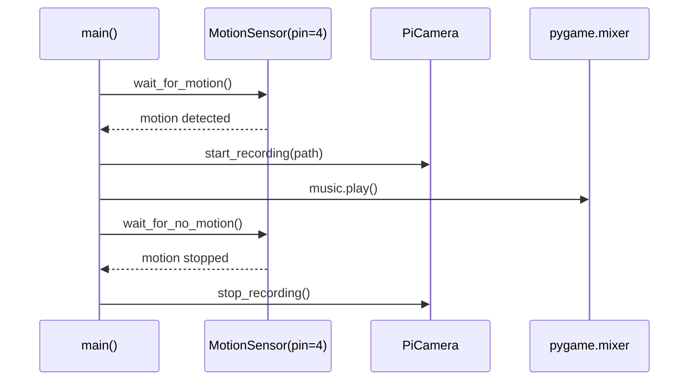

# Interfaces

## Overview

This project has no external APIs or network interfaces. All interfaces are internal function calls and hardware communication via Python libraries.

## Internal Function Interfaces

### main()
```python
def main() -> None
```
Entry point. No parameters, no return value. Runs until KeyboardInterrupt.

### random_mp3()
```python
def random_mp3() -> str
```
- **Returns**: Absolute path to a randomly selected MP3 file
- **Side effects**: None
- **Depends on**: `mp3/` directory existing in CWD with at least one file

### video_file_info()
```python
def video_file_info() -> dict
```
- **Returns**: `{"path": str, "name": str}` — full path and filename for video
- **Side effects**: Creates `videos/` directory if missing
- **Depends on**: Writable filesystem at CWD

### current_time()
```python
def current_time() -> str
```
- **Returns**: Formatted datetime string (`YYYY-MM-DD HH:MM:SS`)
- **Side effects**: None

## Hardware Interfaces



## GPIO Pin Assignment

| Pin (BCM) | Direction | Component | Library |
|-----------|-----------|-----------|---------|
| 4 | Input | PIR HC-SR501 | gpiozero.MotionSensor |

## File System Interfaces

| Path | Type | Access | Purpose |
|------|------|--------|---------|
| `./mp3/` | Directory | Read | Source of MP3 sound files |
| `./videos/` | Directory | Write (auto-created) | Destination for recorded video |
