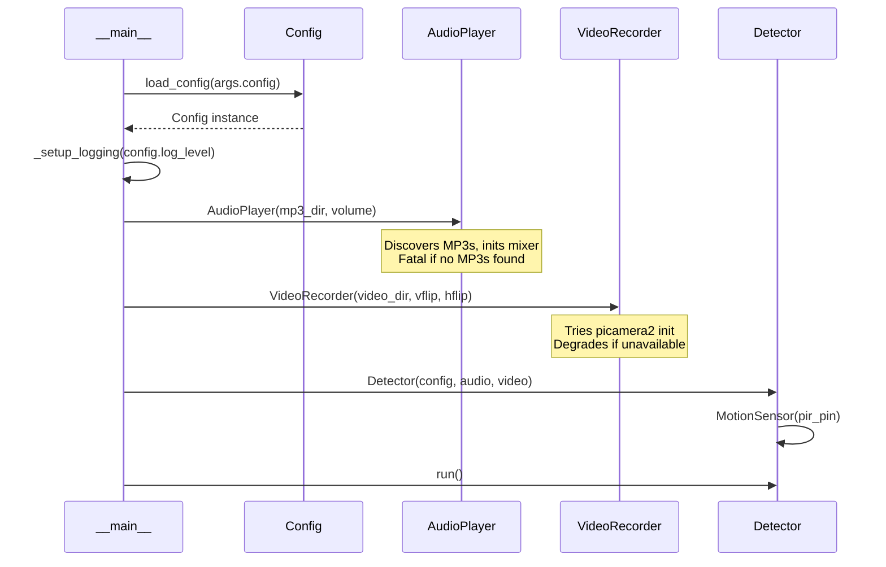
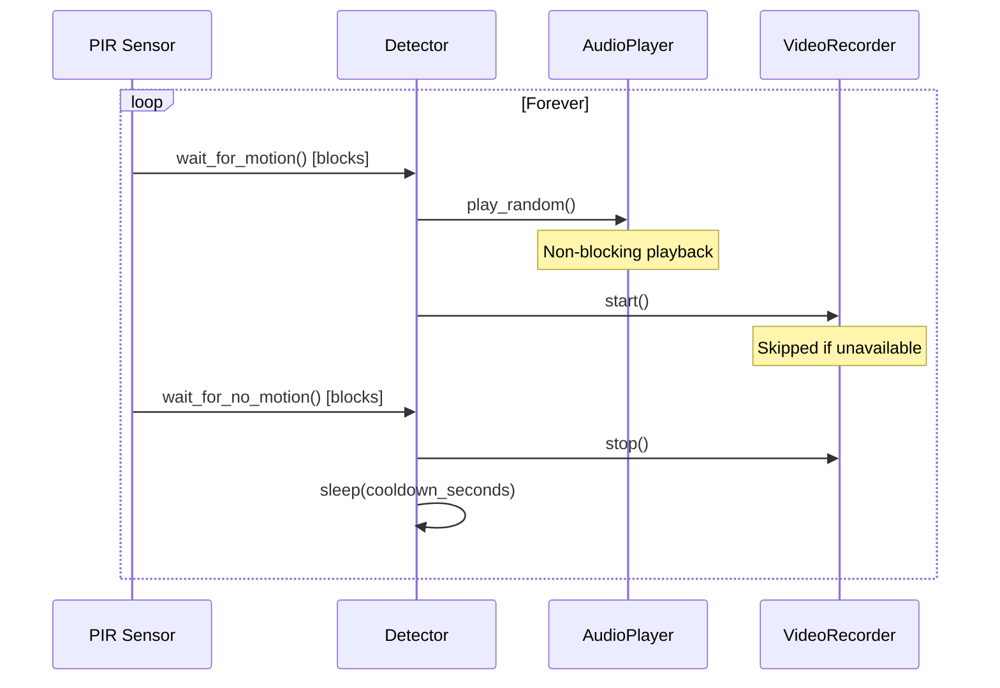
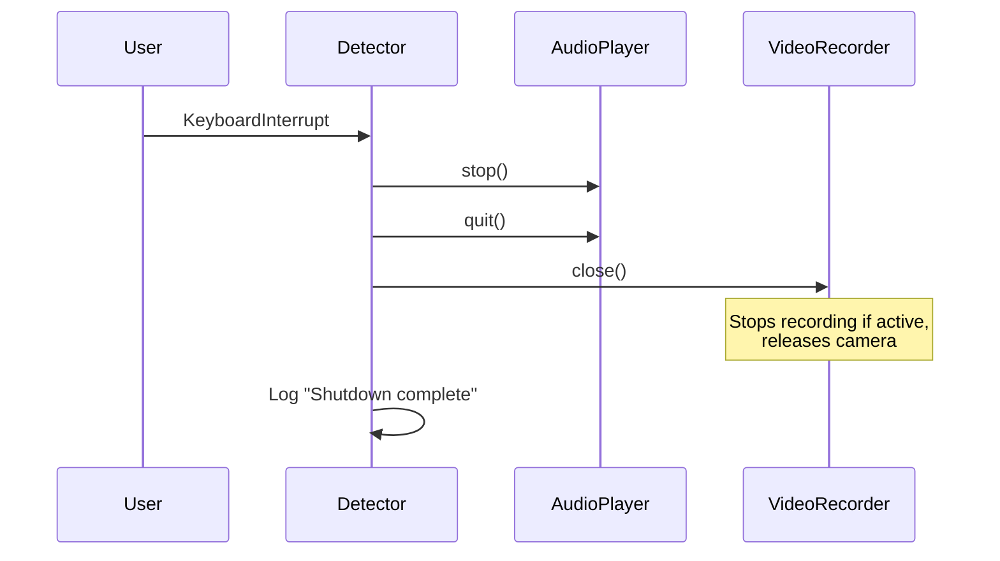

# Workflows

## Application Startup

## Detection Loop

## Graceful Shutdown (Ctrl+C)

## Configuration Loading

1. Parse `--config` CLI argument
2. If path is None or file doesn't exist → return `Config()` with defaults
3. If file exists → parse with `tomllib`
4. If TOML is invalid → log error, `sys.exit(1)`
5. Map TOML sections to Config fields (missing keys use defaults)
6. Validate: volume 0.0–1.0, pin 0–27
7. If validation fails → log error, `sys.exit(1)`
