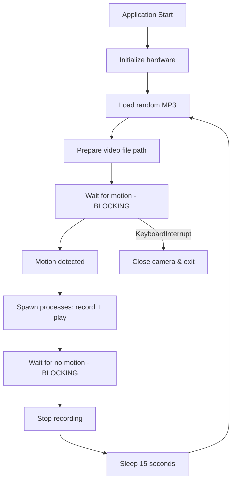

# Workflows

## Main Detection Loop



## Initialization Sequence

1. Create `MotionSensor(4)` — PIR on BCM pin 4
2. Create `PiCamera()` — configure vflip=True, hflip=True
3. Initialize `pygame.mixer` — set volume to 10

## Detection-Response Cycle (per iteration)

1. **Pre-load**: Select random MP3, generate video filename
2. **Wait**: `pir.wait_for_motion()` blocks until PIR triggers HIGH
3. **React**: Launch camera recording and audio playback via multiprocessing
4. **Monitor**: `pir.wait_for_no_motion()` blocks until PIR goes LOW
5. **Stop**: `camera.stop_recording()`
6. **Cooldown**: `time.sleep(15)` prevents rapid re-triggering

## Shutdown

- Triggered by `KeyboardInterrupt` (Ctrl+C)
- Calls `camera.close()` to release hardware resource
- Process exits

## Development Workflows

### Run Tests
```bash
make test        # or: py.test
make test-all    # runs tox across Python versions
```

### Lint
```bash
make lint        # runs flake8
```

### Build Documentation
```bash
make docs        # Sphinx HTML docs
```

### Release
```bash
make release     # sdist + bdist_wheel upload
```
